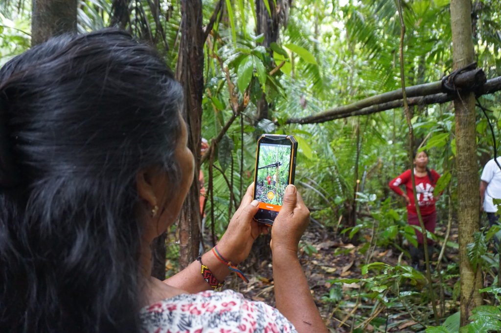

# Introduction

## Mapeo is a free, easy-to-use, open source set of tools for collecting and mapping information.&#x20;

Mapeo was built by Digital Democracy with and for earth defenders to easily document environmental & human rights information and to collect data about their land. It was designed to work in entirely offline environments, is highly customizable, and built on a decentralized peer-to-peer database that allows communities to own their own data.

## About this Guide

This site provides an introduction to the Mapeo tools and a collection of training & technical resources to support Mapeo users.

The site is divided into the following sections:

* **Overview**\
  Basic information about the Mapeo tools
* **Quick Start Guide**\
  Instructions to install and test Mapeo's default functionality
* **Complete Reference Guide**\
  ****A complete collection of resources on planning & implementing projects using Mapeo and customization of the tools

### Use of this guide

_Digital  Democracy would like both Mapeo and Mapeo reference materials we develop to help communities find ways to support autonomy, accesibility and collaboration in their projects. We know that people accessing this online resource will have diverse interests, goals, needs, and technical literacy. For this reason, there are a variety of paths to access information and levels of details users may be looking for.  In addition, we are including commonly requested printable versions of instructions in respective sections. _

_Feel free to make use of these resources under the creative commons license terms: _[Attribution-NonCommercial 4.0 International](https://creativecommons.org/licenses/by-nc/4.0/)&#x20;

### Contributions

Feedback, edits, and additions to these materials are welcome! They can be provided here: `(is gitbook the best way?)`

**Translation**\
****We strive to make our tools & resources accessible and available to communities in their local languages. If you'd like to contribute to translating this guide, please visit the project on Crowdin to get started. If you don't see your desired language listed, please contact us so we can get you set up.

#### Open Source Development

Visit _**For Developers**_ to find out more

#### Other Contributions

_Mapeo is a project of Digital Democracy, a non-profit organization that works in solidarity with marginalized communities to use technology to defend their rights. For more information on Digital Democracy,  and how to support our user-centered co-development process visit _[_our website_](https://www.digital-democracy.org)_._
