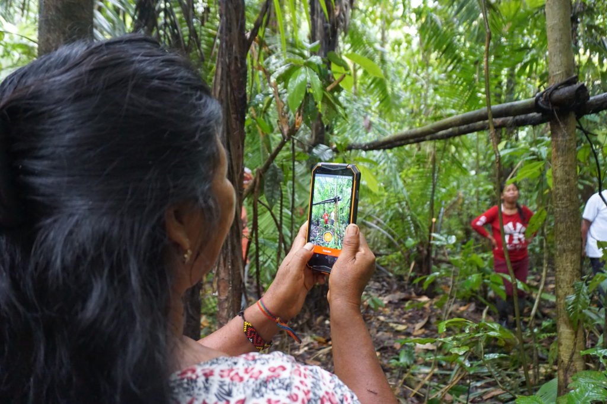

# Introduction

## Mapeo is a free, easy-to-use set of tools for collecting and mapping information. 

It was built with and for earth defenders to easily document environmental & human rights information and to collect data about their land. Mapeo was designed to work in entirely offline environments, is highly customizable and built on a decentralized peer-to-peer database that allows communities to own their own data.

## About this Guide

This site provides an introduction to the Mapeo tools and a collection of training & technical resources to support Mapeo users.

The site is divided into the following sections:

* **Overview** Basic information about the Mapeo tools
* **Quick Start Guide** Instructions to install and test Mapeo's default functionality
* **Complete Reference Guide** A complete collection of resources on planning & implementing projects using Mapeo and customization of the tools

**Translation**  
We strive to make our tools & resources accessible and available to communities in their local languages. If you'd like to contribute to translating this guide, please visit the project on Crowdin to get started. If you don't see your desired language listed, please contact us so we can get you set up.

_Mapeo is a project of Digital Democracy, a non-profit organization that works in solidarity with marginalized communities to use technology to defend their rights. For more information on Digital Democracy, visit_ [_our website_](https://www.digital-democracy.org/)_._

