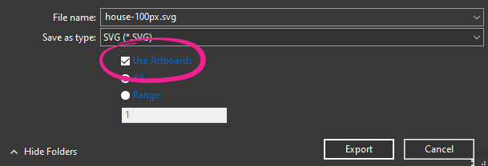
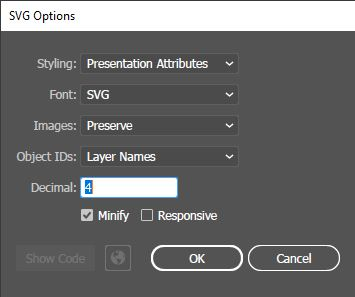

# Creating and exporting SVG files using Adobe Illustrator

[Adobe Illustrator](https://www.adobe.com/products/illustrator.html) is a vector graphics editor and design program developed by Adobe Inc. Although it is a commercial, licensed product, it is very commonly used to put together vector graphics, and many users utilize this tool for creating icons for Mapeo as well.

### &#x20;Exporting `.svg` files with the right properties

When you're ready to export a vector graphic file into a Mapeo-compatible `.svg` file format, the process is as follows:

* On the Adobe Illustrator top menu, click on **File** and then select **Export,** followed by **Export As.**
* Ensure that **Use Artboards** is checked.

* Save your `.svg`  file in the correct directory (**`icons`** for Mapeo configurations) and with your desired filename, and click **Export**.
* In the following window, ensure that the following properties are set, and then click **OK**:

Your `.svg` file should now be ready to be used by Mapeo. See [#naming-icon-files](./#naming-icon-files "mention") for more information on how to name the files and where to place them in the configuration directory.
