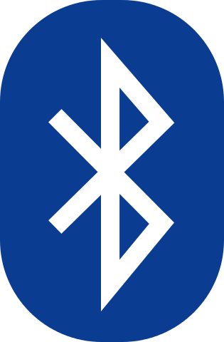

# Glossary of Mapeo related terms

* [APK](glossary-of-mapeo-related-terms.md#apk)&#x20;
* [Application (app)](glossary-of-mapeo-related-terms.md#application-app)
* [Background map](glossary-of-mapeo-related-terms.md#background-map)
* [Background map package](glossary-of-mapeo-related-terms.md#background-map-package-or-base-map-package)
* Bluetooth
* Bug
* Category
* Compressed file (`.zip`)

#### **APK**&#x20;

APK files, also called here "Installation files (`.apk`)",  have a `.apk` [extension ](glossary-of-mapeo-related-terms.md#file-extension)and can be used by Android phones to distribute and install mobile [apps](glossary-of-mapeo-related-terms.md#application-app). For example, you can download the Mapeo Mobile APK file to install Mapeo on Android smartphones offline. Learn more about it in [#install-from-apk-file](../mapeo-mobile-installation-setup/installing-mapeo-mobile.md#install-from-apk-file "mention")&#x20;

#### **Application (app)**&#x20;

An app is a type of software that can be installed and used on a computer, a smartphone, or on another electronic device and has been designed for a specific function. For example, Mapeo Mobile is an app for Android smartphones and Mapeo Desktop is an app for computers. Both have been designed for and with earth-defenders to map and monitor their lands. Some very famous apps that have been designed for communication purposes are Whatsapp, TikTok, and Zoom.&#x20;

#### **Background map**&#x20;

In a Mapeo project, they are the maps used in the background of the home screen. In Mapeo Mobile, background maps are used to show users their current location and that of the collected data. In Mapeo Desktop, they are used as a background in the map screen for displaying data collected, created, or imported to Mapeo. Background maps can be customized (see more about it in [custom-base-maps](../customization-options/custom-base-maps/ "mention")) and usually, they include geographic elements such as rivers and mountains, as well as some political and urban elements such as borders, cities, roads, and others.&#x20;

#### Background map package&#x20;

A Mapeo background map package consists of several folders and files that, used at the same time, create a [background map](glossary-of-mapeo-related-terms.md#background-map-or-base-maps). They are often shared as a [compressed file`(.zip)`](glossary-of-mapeo-related-terms.md#compressed-file-.zip).&#x20;

#### **Bluetooth**&#x20;

It is a wireless technology used for exchanging [data ](glossary-of-mapeo-related-terms.md#data)between devices over short distances (less than 10 meters) using radio waves. Currently, most smartphones and computers offer this option, but you might need to activate the ****  Bluetooth in your device before sharing or receiving data. Bluetooth can be a useful way to exchange files in [offline ](glossary-of-mapeo-related-terms.md#offline)conditions. For example, even with an internet connection, you can share a Mapeo [configuration ](glossary-of-mapeo-related-terms.md#configuration)file (`.mapeosettings`) via Bluetooth with other devices.

#### **Bug**

In this context, a bug is an error or flaw in the software that causes it to produce an unexpected result, or to behave in unintended ways. We call "**debugging**" the process of finding and correcting bugs. Mapeo is under development and it may have some bugs that need to be fixed. If you ever encounter unexpected or incorrect behaviors, you can share them with us via <mark style="color:red;">XXXX</mark>, so that we can debug them.

#### **Category**

In a Mapeo project, categories are the different groups or classes in which you can classify the [data ](glossary-of-mapeo-related-terms.md#data)collected or created using Mapeo. For example, when you create a new point on the map, you can choose among categories such as "house", "tree", "hunting site" and many others to classify it. Each category is represented by a different icon and has different questions attached to it. By default, Mapeo comes with a set of categories, but they can be customized. For more information on customization, see [custom-configurations](../customization-options/custom-configurations/ "mention").

#### **Compressed file (`.zip`)**

Compressed or **zipped files** and **folders** are commonly used because they take up less storage space than uncompressed files and can be transferred to other computers more quickly. They have an `.zip` [extension ](glossary-of-mapeo-related-terms.md#file-extension)and can be easily created and unzipped. In Mapeo, we use compressed folders to share [background map packages](glossary-of-mapeo-related-terms.md#background-map-package), since they are composed of many files, and it is easier to share them as a folder.

#### **Configuration**

In Mapeo, the configuration of a project determines which categories, icons, and questions users see when they are collecting [data](glossary-of-mapeo-related-terms.md#data). For each data point collected with Mapeo, users can select a category to classify the point and may answer questions or respond to prompts to provide more detail about what is being documented. When you install Mapeo, it comes with a **default configuration** that includes general categories and questions for territory mapping and monitoring. Mapeo offers the option to create **custom configurations** to fit the needs of specific projects. For more information on customization, see [custom-configurations](../customization-options/custom-configurations/ "mention").

#### Coordinates

ADD CONTENT - Universal Transverse Mercator (UTM), Degrees/Minutes/Seconds (DMS), and Decimal Degrees (DD)

#### **Crowdin**

It is a platform that helps companies and organizations to translate their software. We use the [Crowdin](https://crowdin.com) platform to translate Mapeo into different languages. It is free to create an account on Crowdin and anyone can contribute translations to Mapeo for new or existing languages. For more information, see [translating.md](../customization-options/translating.md "mention")

#### **Data**

It refers to information in digital form that can be transmitted or processed. In Mapeo, the word "data" is used for both [observations ](glossary-of-mapeo-related-terms.md#observation)collected by Mapeo Mobile <mark style="color:red;"></mark> (**observation data**) as well as lines, points, and polygons created using Mapeo Desktop (**territory data**). Data can be organized and stored in **databases** and be accessed electronically. Add g<mark style="color:red;">eospatial data, data set</mark>

#### Feature

We use the word features to describe things that appear on the map, such as rivers, buildings, or points of interest. In Mapeo Desktop - Territory mode, you can create features in the form of points, lines, and areas.

#### File extension

It refers to the letters appearing at the end of a file's name, after the dot. It indicates the type of file. Common examples are `.doc` for Word documents, and `.pdf` for PDF files. In a Mapeo project, some files have very uncommon extensions, such as `.mapeosettings` for the [configurations ](glossary-of-mapeo-related-terms.md#configuration)and `.mapeodata` for [sync files](glossary-of-mapeo-related-terms.md#sync-files).

#### Georeference?

#### GPS

The GPS acronym stands for "Global Positioning System", which is a satellite navigation system that allows determining the ground position (or [coordinates](glossary-of-mapeo-related-terms.md#coordinates)) of an object. When we here talk about a **GPS device,** we are referring to a portable tool that allows gathering information on the user's current position, allows saving specific locations as points as well as [tracks](glossary-of-mapeo-related-terms.md#tracks) of the paths traveled. Most smartphones have a **GPS feature** that gathers the user's current position. This feature norlly appears under the names **GPS** or **Location**. This is what Mapeo Mobile uses to gather the coordinates of a point when creating a new [observation](glossary-of-mapeo-related-terms.md#observation). In Mapeo Mobile, the **accuracy of the GPS** signal received by our smartphone is shown with a _±numer of meters_ (e.g.), and it refers to the margin of error of the given coordinates. The bigger the number, the less accurate the GPS signal is.&#x20;

#### Keyboard?&#x20;

<mark style="color:purple;">Should we have a keyboard where we show what Space, Enter, etc. are? They are mentioned in Territory mode.</mark>

.png>)

.png>)

#### Location?

#### **Mapeo project?**

#### **Modem?**

#### Mouse?

left-click, right click- double click...?

**Node**

context - territory mode, creating lines

#### **Observation**

In a Mapeo project, an observation refers to a point on the map collected by Mapeo Mobile. It is based on a geographic location (it has [coordinates](glossary-of-mapeo-related-terms.md#gps-georeference-coordinate-formats-location)) and can have associated photos, notes, and other details**.**

#### **Offline**

Not connected to the internet.

#### **Online**

Connected to the internet.

#### **Peer-to-peer**:&#x20;

Also called **P2P**, it refers to a [database ](glossary-of-mapeo-related-terms.md#data)or network that connects all different devices participating in a project, such as cell phones or computers. This is the type of database used by Mapeo and it allows users to transfer data to other users [offline](glossary-of-mapeo-related-terms.md#offline), and also allows several users with computers or smartphones to all work on the same dataset and share edits. For more on this, read [peer-to-peer-and-mapeo-sync.md](../../overview/about-mapeo/peer-to-peer-and-mapeo-sync.md "mention")

#### **Play Store**

Also called **Google Play**, or **Google Play Store**, it is the official app store for Android and <mark style="color:red;">Chrome OS</mark> devices. There you can browse and download many [applications](glossary-of-mapeo-related-terms.md#application-app), including Mapeo Mobile. Some of them are free, like Mapeo, and others are at a cost. You can access the Play Store space from any Android and <mark style="color:red;">Chrome</mark> smartphone by clicking on the Play Store icon n your device.

**Portable battery**

It is a form of portable power supply that provides charging for smartphones, tablets, and other devices. If you plan to use Mapeo and you won't have access to a charger and an electrical outlet (e.g. if you are on a patrol or you are in the woods), it's good to take a fully-charged portable battery with you, so that you can recharge your device if needed.&#x20;

#### **Project key**

In Mapeo, a project key is a <mark style="color:red;">random cryptographic string of characters</mark> that prevents unwanted devices from getting access to your [data ](glossary-of-mapeo-related-terms.md#data)and allows you to [synchronize ](glossary-of-mapeo-related-terms.md#synchronization)data with your teammates. It offers more security since synchronization will only happen between Mapeo devices using the same project key, ergo, participating in the same project.

#### **Router**

A router is a device that is designed to receive, analyze, and forward [data ](glossary-of-mapeo-related-terms.md#data)packets between [networks](glossary-of-mapeo-related-terms.md#wi-fi-network). In an [offline ](glossary-of-mapeo-related-terms.md#offline)context, you can use a portable router to create a [Wi-Fi](glossary-of-mapeo-related-terms.md#wi-fi-network) internet-free network to which devices can be connected and share data with each other. For example, by using a network created by a portable router, Mapeo allows [synchronizing ](glossary-of-mapeo-related-terms.md#synchronization)data between devices anywhere, without the need for an internet connection, as long as the devices are connected to the same network.

**Shapefile**

#### **Synchronization**

In a Mapeo project, synchronization is a process in which information is shared directly between different devices, and each device receives and shares [data](glossary-of-mapeo-related-terms.md#data). In this non-hierarchical process, all devices that synchronize end up having the same information, and changes made on one device will be reflected on the other devices after syncing. To know more about it, visit [peer-to-peer-and-mapeo-sync.md](../../overview/about-mapeo/peer-to-peer-and-mapeo-sync.md "mention")

#### Sync files

It is a type of file created in Mapeo Desktop that allows the [synchronization ](glossary-of-mapeo-related-terms.md#synchronization)of Mapeo [data ](glossary-of-mapeo-related-terms.md#data)between computers. It has an `.mapeodata` extension and, similarly to synchronization via [Wi-Fi](glossary-of-mapeo-related-terms.md#wi-fi-network), it uses a two-way sync method. To learn more about how synchronization works, see [synchronizing-with-a-file.md](../mapeo-desktop-use/synchronizing-data-with-mapeo-desktop/synchronizing-with-a-file.md "mention")

#### Territory mapping?

#### Tracks (Waypoints, routes?)

#### **USB stick**

Also called **USB flash drive**, is a small [data ](glossary-of-mapeo-related-terms.md#data)storage device with an integrated USB interface. You can connect it easily to most computers, and many smartphones (you might need an adapter). It is rewritable and very useful to transfer files from one device to another or to create backups. For more information on how to transfer data using a USB stick, <mark style="color:red;">visit XXXXX link to troubleshooting section.</mark>

#### **Virus**

A computer or smartphone virus, similar to a flu virus, is designed to spread from device to device and causes problems, often impeding the proper functioning of a file, a program, an [app](glossary-of-mapeo-related-terms.md#application-app), or the device itself.

#### **Wi-Fi network**

It is a wireless connection that’s shared with multiple devices via a [router](glossary-of-mapeo-related-terms.md#router). If the router is connected to an internet modem, your Wi-Fi network would have internet. Otherwise, it would be an offline network. Even using an offline Wi-Fi network, Mapeo allows you to [synchronize ](glossary-of-mapeo-related-terms.md#synchronization)data with other Mapeo devices connected to the same network. &#x20;

OTHER - not sure about including them

* Territory map
* Monitoring project:
* Collaborative process:
* Download
* Execute
* Import
* Install
* Update
* Sync
* Share
* GeoJSON
* CSV
* PDF
* Web Map
* installation files? (exe, dmg, appimage...)
* Release - version
* folder
* Whatsapp, Telegram, DRIVE, etc?
* Linux
* Windows
* macOS
