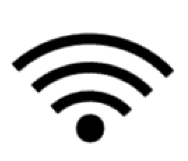

# Synchronizing via Wi-Fi

## Synchronizing via Wi-Fi

Mapeo Desktop can synchronize data via Wi-Fi with other  computers or smartphones that use Mapeo. This is a good sync option when devices are near each other and it works with **no internet connection**.&#x20;

Requirements:

* **Both devices need to be connected to the same** **Wi-Fi network**\
  For devices to sync, both need to be connected to the same Wi-Fi network. This Wi-Fi network does not need to have an internet connection. \

* **Both devices must be using the same configuration**\
  ****It is only possible to synchronize with devices that use the same [configuration](../../customization-options/custom-configurations/#about-custom-configurations). For more on how to import configurations, see [importing-configurations.md](../../mapeo-desktop-installation-setup/importing-configurations.md "mention").

To synchronize, follow the steps below:

### Connect to Wi-Fi

Connect both Mapeo devices to the same Wi-Fi network. In offline environments, a local Wi-Fi network can be created using a mobile wireless router or a third device capable of serving as an offline hotspot.&#x20;


For more on how to create a local Wi-Fi network or connect to Wi-Fi, see\
[creating-local-wi-fi-networks.md](../../troubleshooting/creating-local-wi-fi-networks.md "mention")\
[connecting-to-wi-fi.md](../../troubleshooting/connecting-to-wi-fi.md "mention")


### Enter Synchronize mode

In order to synchronize, both devices must have the **Synchronize** screen open.

In Mapeo Desktop: Click on **Synchronize** in the **Mapeo modes** panel.

In Mapeo Mobile: Tap the  **Synchronize** button on the home screen.

&#x20;

Devices available for syncing will be listed on the **Synchronize** screen. \


Remember that in order for a device to appear in the list, it must be connected to the same Wi-Fi network, have the **Synchronize** screen open, and be using the same project configuration. \
\
You can confirm which configuration Mapeo Desktop is currently using by consulting the white bar at the bottom of the **Synchronize** screen.\
\
For troubleshooting on this step, see [solving-sync-issues](../../troubleshooting/solving-sync-issues/ "mention").


### Start synchronization

Once available devices appear in the list, confirm the identity of the device you plan to synchronize with by consulting the unique identification number on the other user's device.


To see the unique identification number of a Mapeo Mobile device, check the right side of the navy blue bar on the **Synchronize** screen in Mapeo Mobile.


In Mapeo Desktop, click on the **SYNCHRONIZE**  **** button below the device name to begin the exchange of data.&#x20;


**Important**: Keep the **Synchronize** screen open on both devices until the synchronization process is complete.


### View synced observations

To learn about viewing and managing synchronized data:

* In Mapeo Desktop, continue to [Broken link](broken-reference "mention")
* In Mapeo Mobile, see [#view-synced-observations](../../mapeo-mobile-use/wifi-sync.md#view-synced-observations "mention")<mark style="color:blue;"></mark>
