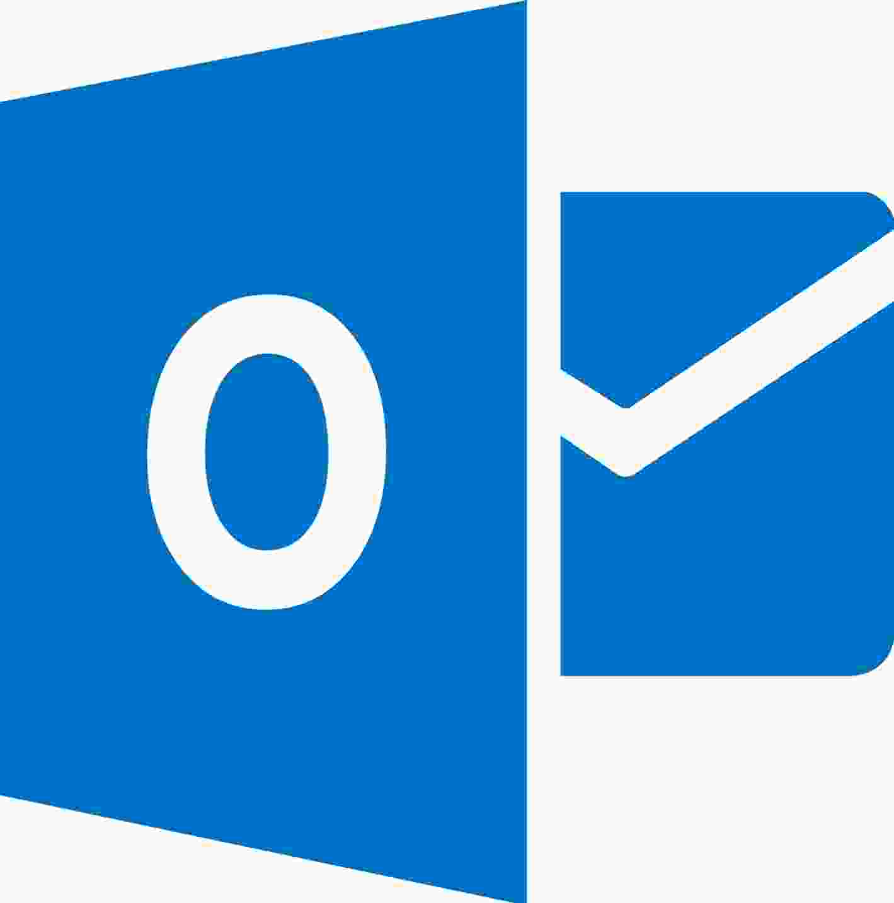
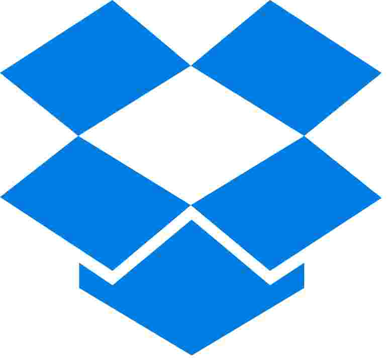

# Synchronizing with a file

While other options allow the synchronization between smartphones and computers, synchronizing with a file is only possible between computers.

In this option, a sync file is created in Mapeo Desktop on one computer and then it is used by another computer with Mapeo to exchange data. During the synchronization, all data contained in the sync file is transferred to the computer that is syncing with it, and all data in the Mapeo database of the computer will also be transferred to the sync file. It uses the same two-way method as synchronization via Wi-Fi. To learn more about how synchronization works, see [peer-to-peer-and-mapeo-sync.md](../../../../overview/about-mapeo/peer-to-peer-and-mapeo-sync.md "mention").

* **If devices are near** each other, this is a good sync option when you can't create a local Wi-Fi network. You can instead use a USB drive to copy and paste the sync file between different devices. It works with **no internet connection**.
* **If devices are not near** <mark style="color:red;"></mark> each other, this is also a good sync option. In this case, you will either need to transport a USB drive to the location of the second device or have access to an internet connection.&#x20;

Other requirements:&#x20;

* **Both devices must be using the same configuration**\
  ****It is only possible to sync with sync files created by devices that use the same [configuration](../../../will-mapeo-work-out-of-the-box-for-me/default-configuration.md#about-configurations). For more on how to import configurations, see[importing-configurations.md](../../../mapeo-desktop-installation-setup/importing-configurations.md "mention")[importing-configurations.md](../../../mapeo-mobile-installation-setup/importing-configurations.md "mention").

## Create a sync file

1. Open  Mapeo Desktop on  computer 1, the computer on which you want to create a sync file. The generated sync file will include **all** the Mapeo data from that computer.
2. Click on **Synchronize** on the **Mapeo modes** panel

3\. Click on the **Create a sync file** button and choose the name and location where the generated file will be saved.

## Send or copy the sync file to the second device

There are two options for sharing a sync file:

* [**Send sync file via email or file sharing service**](synchronizing-with-a-file.md#send-sync-file-via-email-or-file-sharing-service)\
  (Requires an internet connection)
* [**Copy and paste sync file using a USB drive**](synchronizing-with-a-file.md#option-2.-copy-pasting-it-among-different-devices-with-no-internet-connection-you-will-need-a-usb-dr)\
  (Works with no internet connection)

#### **Option 1. Send sync file via email or file sharing service**

1. Locate the generated sync file on  computer 1.
2. In your email app (Gmail, Hotmail, etc.), create a new email and attach the sync file. Send it to the user of the  computer 2, the computer with which you want to sync.
3.  Computer 2 must receive the sync file and save it. It is important to remember where has it been saved.


If the sync file is too large to be sent by email, you can use other platforms such as  [WeTransfer](https://wetransfer.com),  [Google Drive](https://www.google.com/drive/), or [Dropbox](https://www.dropbox.com). You can send files up to 2GB for free using these apps.


#### **Option 2. Copy and paste sync file using a USB drive**

* Connect a USB drive to  computer 1, where you generated the sync file.
* Locate the generated sync file on  computer 1 and click on it using the right button of the mouse. Select **Copy**.
* Navigate to the USB drive in the file system. Right-click on the location and select **Paste** to paste the sync file onto the drive.
* Disconnect the USB drive and connect it to the computer you want to sync with ( computer 2).
* Navigate to the USB drive folder and locate the sync file. Right-click on the file and select **Copy**. Navigate to where you would like to save the sync file on  computer 2. Right-click on the location and select **Paste**.

## Start synchronization

1. Locate the received or pasted sync file on  computer 2, the computer you want to sync with.
2. Open  Mapeo Desktop on computer 2.
3. Click on **Synchronize** in the Mapeo modes panel.

4\. Click on the **Sync from a file** button and in the pop-up window, navigate until you find the desired sync file. Then click on it and click **Open**.Start synchronization

The synchronization with the file will automatically begin.&#x20;


**Important**: Keep the **Synchronize** screen open on both devices until the synchronization process is complete.



When the synchronization is complete, computer 2 and the sync file will have identical copies of the Mapeo database. To complete a 2-way synchronization between the two computers, repeat the process to copy the sync file back to  computer 1 and use it to **Sync from a file**.


### View synced observations

To learn about viewing and managing synchronized data in Mapeo Desktop **Observations** mode, continue to:


[viewing-observations.md](../viewing-observations.md)

