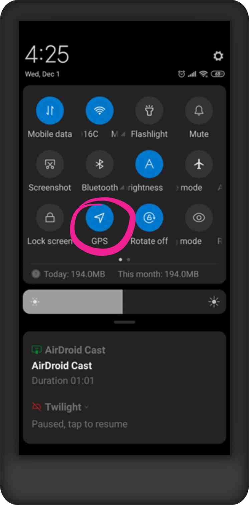

# My GPS signal is very weak

### Why does this happen?&#x20;

Normally, it happens when there is no good communication between the GPS and the satellite. There may be one or more factors that cause the problem: problems with low satellite coverage, being indoors or in places with a lot of vegetation, not having activated the phone's GPS, or damage to the device's hardware and software, among others.

### How is it solved?&#x20;

To solve this problem, we suggest you explore the different solutions, in this order:&#x20;

1. First of all, make sure that you have GPS enabled on your cell phone. \
   It will be different on each phone, but **GPS** or **Location** services can usually be found in the **Quick Settings** menu, which can be accessed by swiping down from the top of the screen. ​​ ​ \
   
2. Confirm that Mapeo Mobile has access to the GPS. The **GPS details** button at the top of the home screen will display a green dot and the accuracy of the GPS signal: ​\
   &#x20;


If you turn on GPS on your device while using **Mapeo**, you may need to restart Mapeo for the app to recognize that GPS is turned on and for it to change the state of the **GPS details** button. ​


3.  Confirm that the GPS sensors are enabled. For it:&#x20;

    1. Click on  **GPS Details**&#x20;
    2. On the **GPS Details** screen, make sure that in the **Sensor Status** section at the end of each line, it says **YES**.&#x20;
    3. In the event that one or more sensors are not activated or enabled, please check the manufacturer's manual for your device to activate it.\
       

    If you still have a weak GPS signal, try these tips:&#x20;

### Tips to improve the GPS signal:&#x20;

* Locate in clear places or without vegetation.&#x20;
* In the field, if you have a bad signal, take the phone out of the case (especially useful for CAD phones, rugged phones, etc).&#x20;
* Perform a calibration of the GPS sensor. For more information check [this link](https://support.google.com/maps/answer/2839911?hl=es-419\&co=GENIE.Platform%3DAndroid#zippy=%2Ccalibra-tu-tel%C3%A9fono-o-tablet).&#x20;
* Validate that the date and time of your device are updated. For this, follow these steps:&#x20;
  * Open the **Settings** app on your phone.&#x20;
  * Click **System** and then select **Date and time**.&#x20;
  * Click **Automatic**. If the option is disabled, check that the correct date, time, and time zone are selected.&#x20;
  * In the event that it fails to update the time and date, turn off the Automatic date and time option, then manually change the corresponding time and date.&#x20;
* Activate the high-precision function in the GPS. For more information check [this link](https://support.google.com/maps/answer/2839911?hl=es-419\&co=GENIE.Platform%3DAndroid).&#x20;

### If the GPS signal still does not improve...&#x20;

If, despite having tried several solutions, the GPS signal does not improve, you always have the option of using another phone or GPS device to identify the GPS data and enter it manually in Mapeo. If the GPS signal at the time of saving the observation has an accuracy less than ± 10 m, Mapeo will automatically offer you three options. Click **MANUAL COORDS** to manually enter the coordinates you want to use.

You can choose which GPS data format you want to use to enter the coordinates. This is a useful option if you have a GPS or other phone device with better GPS signal accuracy.

 

Click  **Save** once you have manually entered the coordinates to return to the **Edit Observation** screen.

