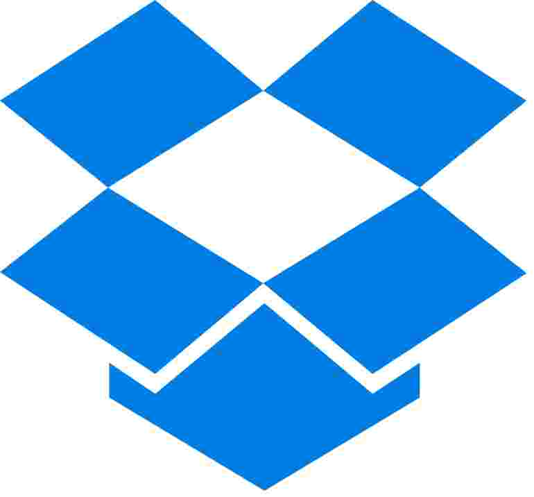

# Sharing files between devices

See the sections below for different file sharing options:

* [Sharing files between devices with an **internet connection**](./#sharing-files-between-devices-with-an-internet-connection)
* [Sharing files between devices with **no internet connection**](./#sharing-files-between-devices-with-no-internet-connection)

## **Sharing files between devices with an internet connection**

If you have access to an **internet connection**, you can share files in multiple ways. The optimal way depends on the size and type of the file. Below are our recommendations:

####  **Mapeo Mobile**

* Configuration files (`.mapeosettings`) - **Telegram** app, **email,** or **Google  Drive.**
* Installation files for Mapeo Mobile (`.apk`) - **Telegram** app, **email,** or **Google  Drive.**
* Base maps (folder `.zip`) - we recommend using a computer and a USB cable, because it requires navigation inside the file system of the smartphone and pasting the base map elements in a specific location. For instructions on that process, see [adding-custom-base-maps-to-mapeo-mobile.md](../../mapeo-mobile-installation-setup/adding-custom-base-maps-to-mapeo-mobile.md "mention")

To share and add base maps to Mapeo Mobile, we recommend using a computer and a USB cable, because it requires navigation inside the file system of the smartphone and pasting the base map elements in a specific location. For instructions on that process, see [adding-custom-base-maps-to-mapeo-mobile.md](../../mapeo-mobile-installation-setup/adding-custom-base-maps-to-mapeo-mobile.md "mention")\
\
You can also share larger files (up to 2GB) for free via Drive, Dropbox, WeTransfer or other online platforms.

Note: Sending installation (`.apk`) and configuration (`.mapeosettings`) files with other apps encounter problems with the size and type of the files.

 **Mapeo Desktop**

* Configuration files (`.mapeosettings`)&#x20;
* Installation files for Mapeo Desktop (`.exe`, `.dmg` , `.zip` , `.AppImage`)&#x20;
* Base map folders&#x20;
* Sync files (`.mapeodata`)&#x20;

For Mapeo Desktop, you can use multiple platforms to share files.&#x20;

* We recommend using email apps such as Gmail or Hotmail for sharing lightweight files (smaller than 10MB).&#x20;
* We recommend using Drive, Dropbox, WeTransfer to share heavier files as they allow you to send up to 2GB for free.

## **Sharing files between devices with no internet connection**

If you do not have access to an internet connection, there are multiple ways to share files between devices.

* Copy and paste files using a USB drive or cable
* Send via Bluetooth using Android, SHAREit or other apps

 **Mapeo Mobile**

Android devices that are near each other can use Bluetooth to transfer files without an internet connection. Bluetooth transfer will be quicker for lighter weight files, such as:

* Configuration files (`.mapeosettings`):
* Installation files for Mapeo Mobile (`.apk`):

To transfer files using Android's Bluetooth:

1. Activate **Bluetooth** on both devices. Bluetooth settings can generally be found in the Quick Settings menu, accessed by swiping down from the top of your screen.
2. On the Bluetooth settings screen, tap **Pair new device** and wait for the list of AVAILABLE DEVICES to populate.\
   The screen of both devices should be open and unlocked to appear available for syncing.
3. Once you see the device you would like to share files with and confirm its identity, tap on the device name to pair.
4. Confirm the code and the pair request on both devices.
5. Locate and select the file you wish to send and tap  Share. Select Bluetooth in the share options and tap the name of the other device in the list.

You can also use Android apps for Bluetooth sharing, including SHAREit or others.


For transferring larger files (bigger than 10MB) such as base map folders, we recommend connecting to a computer and transferring via cable if possible.\
\
For more on adding base maps to Mapeo Mobile, see [#adding-a-base-map-using-a-computer](../../mapeo-mobile-installation-setup/adding-custom-base-maps-to-mapeo-mobile.md#adding-a-base-map-using-a-computer "mention").


 **Mapeo Desktop**

For transferring files between computers without an internet connection, we recommend using a USB drive.

Most computers can also share files via Bluetooth with other devices that are nearby.

Commonly shared files for Mapeo Desktop include:

* Configuration files (`.mapeosettings`):
* Installation files for Mapeo Desktop (`.exe`, `.dmg` , `.zip` , `.AppImage`):
* Sync files (`.mapeodata`):
* Base map folders
