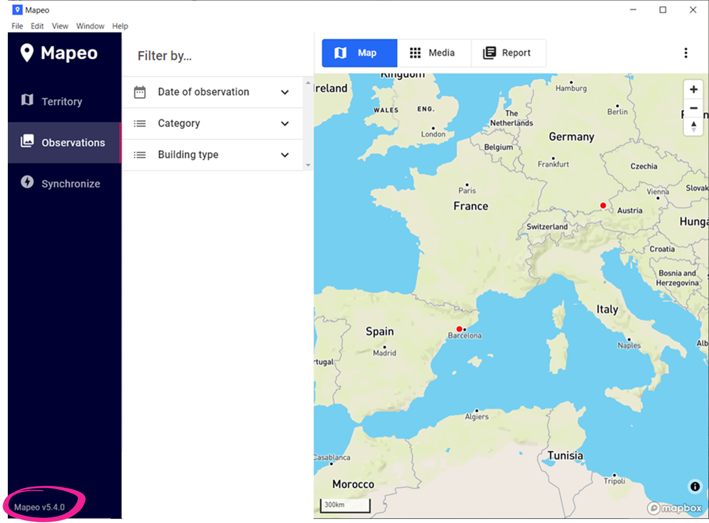

# I can't sync with the sync file

Currently, only computers with Mapeo Desktop installed can sync with a sync file (`.mapeodata`). If you're having trouble syncing with a sync file, explore the various solutions, in this order:

1. [Check that both devices use the same configuration](i-cant-sync-with-the-sync-file.md#check-that-both-devices-use-the-same-configuration)
2. [Check that they use the same version of Mapeo ](i-cant-sync-with-the-sync-file.md#check-that-they-use-the-same-version-of-mapeo)
3. [Make sure the sync file is not corrupted](i-cant-sync-with-the-sync-file.md#make-sure-the-sync-file-is-not-corrupted)

### Check that both devices use the same configuration

To sync with a sync file, the configuration the sync file was created with must be the same as the configuration used by the device you want to sync with.&#x20;

First of all, check that this is the case. To do this, check what configuration the computer you want to sync with is using, and find out what configuration the computer that created the sync file uses. You can check the configuration used in Mapeo Desktop at the bottom of the **Synchronization** screen.

<figure><figcaption></figcaption></figure>

If the configuration is not the same, you have two possible options:&#x20;

**Option A: Change the settings on the target computer**&#x20;

On the computer where you want to sync the file, import the configuration used to create the sync file. For it:

1. On Mapeo Desktop, on the **Top menu** bar, click **File** and select **Import Configuration**.&#x20;
2. In the popup window, navigate to the folder on the computer where you saved the configuration file (`.mapeosettings`) that you want to import. Click the file, then click **Open**. You may see a white screen for a few seconds while the configuration is changed.&#x20;
3. Restart Mapeo Desktop.&#x20;
4. Try again to sync with the desired sync file.

**Option B: Change settings on the source computer**

On the computer where the sync file was created, import the configuration you're using on the computer you want to sync with and recreate the sync file. To do so, follow the next steps:

1. On Mapeo Desktop, on the **Top menu** bar, click **File** and select **Import Configuration**.&#x20;
2. In the popup window, navigate to the folder on the computer where you saved the configuration file (`.mapeosettings`) that you want to import. Click the file, then click **Open**. You may see a white screen for a few seconds while the configuration is changed.&#x20;
3. Restart Mapeo Desktop.&#x20;
4. Re-create the sync file, from the **Synchronization** screen, by clicking the **Create Sync File** button. Do not close or exit the **Synchronization** screen until the process is complete. <mark style="color:red;">**Closing in the middle of the process could create a corrupt sync file.**</mark>
5. Share the sync file with the computer you want to sync with. For more information on this point, see [sharing-files-between-devices.md](../sharing-files-between-devices.md "mention")&#x20;
6. On the destination computer, on the **Synchronize** screen, click **Synchronize with synchronization file**.&#x20;
7. Browse the popup window until you find the desired file and click **Open**. Do not close the synchronization screen until you have finished the synchronization process. <mark style="color:red;">**Closing in the middle of the process could corrupt data.**</mark>

### Check that they use the same version of Mapeo&#x20;

Normally, the use of different versions does not cause problems when synchronizing, although if the versions are very different from each other, it can be problematic. If the sync file was created with a version of Mapeo that is very old or different from the one you use on the computer you want to sync with, you could have problems. To fix this problem, follow the steps below:&#x20;

1.  Make sure the sync file was created using the same version of Mapeo that the computer you want to sync with is using. In Mapeo Desktop, you can see the version used at the bottom left of the **Mapeo modes** panel.\

    <figure><figcaption></figcaption></figure>

If they use the same version, skip to the next step.&#x20;

2\. If they are not using the same version, you will need to update Mapeo on the device that is using the older version. For more information visit [updating-mapeo-desktop.md](../../mapeo-desktop-installation-setup/updating-mapeo-desktop.md "mention")

### Make sure the sync file is not corrupted

There may be a few factors that lead to a corrupt sync file. One of them could be leaving the synchronization page before the process of creating a synchronization file has been completed. Another could be that you have synced the file with a corrupted database. But there could be more factors.&#x20;

To address this issue, follow the steps below:&#x20;

1. If possible, create a new sync file and try to sync with the destination computer again. Do not close the synchronization screen until you have finished the process. Closing in the middle of the process could create a corrupt sync file.&#x20;
2. If it is not possible to create a new sync file again, or if you have tried it and it does not work, contact the Digital Democracy technical team through our multilingual **mapeo-users** chat on [Discord](https://digital-democracy.us2.list-manage.com/track/click?u=e5898ac1e68db70ce0dfefa88\&id=af17ade556\&e=c6a0dac4c6).

#### Indicators of corrupted data

To investigate on your own if the sync file is corrupted, you can use the following clues:&#x20;

* If when creating the synchronization file, Mapeo has been frozen for many hours, it is likely that you have corrupted data.&#x20;
* If when synchronizing with a synchronization file, Mapeo Desktop freezes for many hours in the synchronization process, without increasing the number of Data or Images, it is likely that the synchronization file contains corrupted data.&#x20;
* If there are observations with photographs in your Mapeo Desktop or Mobile database that you cannot open, it is likely that those observations are corrupted.&#x20;
* If in your Mapeo Desktop or Mobile database there are observations with dates that don't make any sense (for example, 1970), it is likely that those observations are corrupted.&#x20;

You can try deleting that data and creating a new sync file (`.mapeodata`), but we think it's safer to contact Digital Democracy's technical team via our multilingual  [Discord](https://digital-democracy.us2.list-manage.com/track/click?u=e5898ac1e68db70ce0dfefa88\&id=af17ade556\&e=c6a0dac4c6) **mapeo-users** chat for advice.
