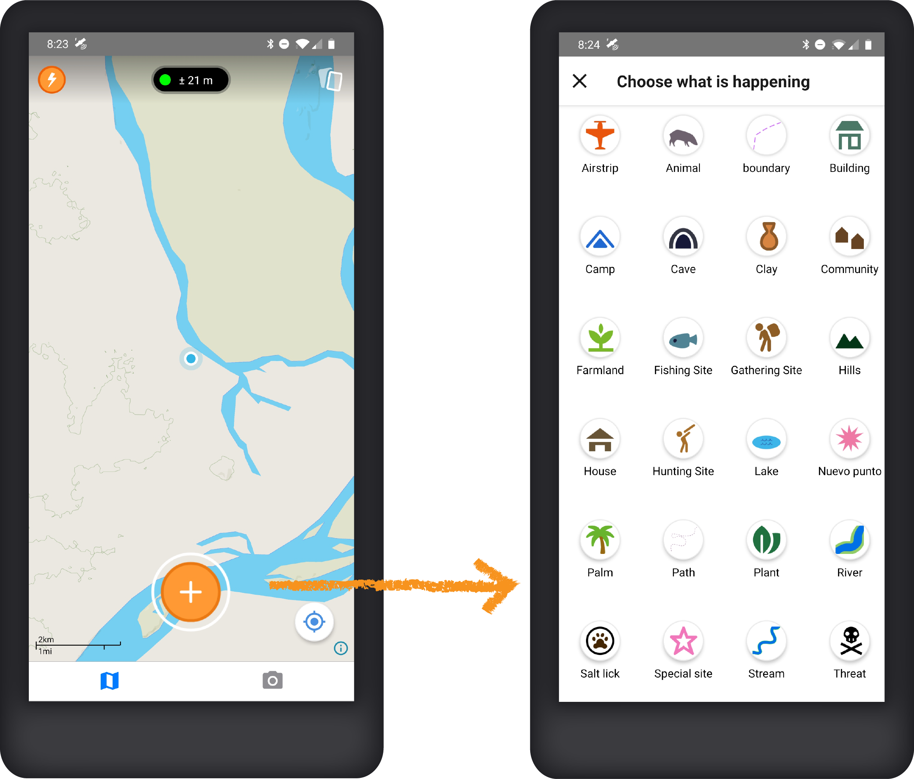
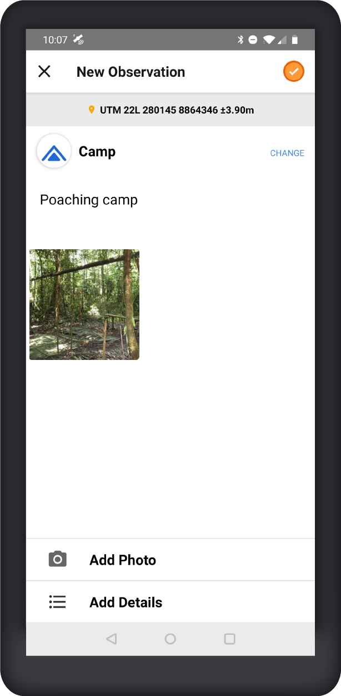
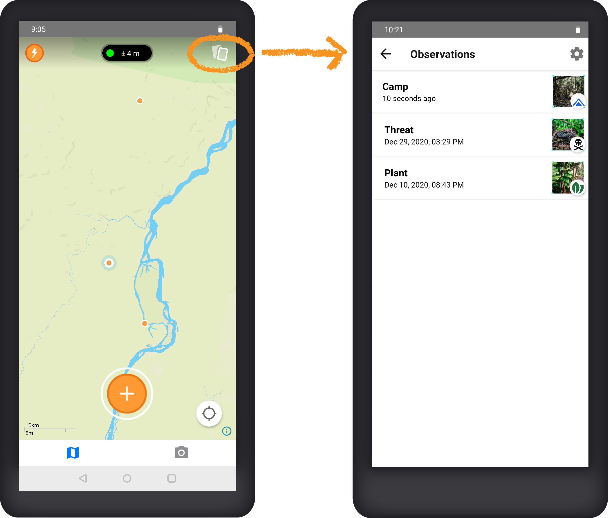
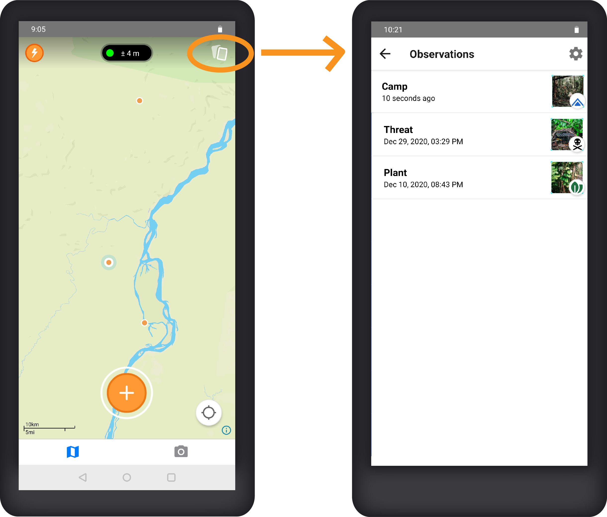
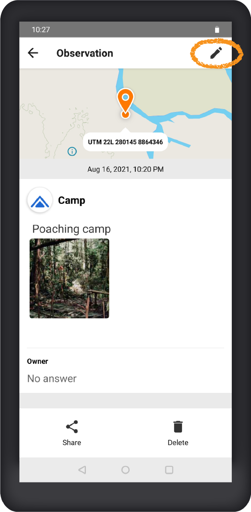
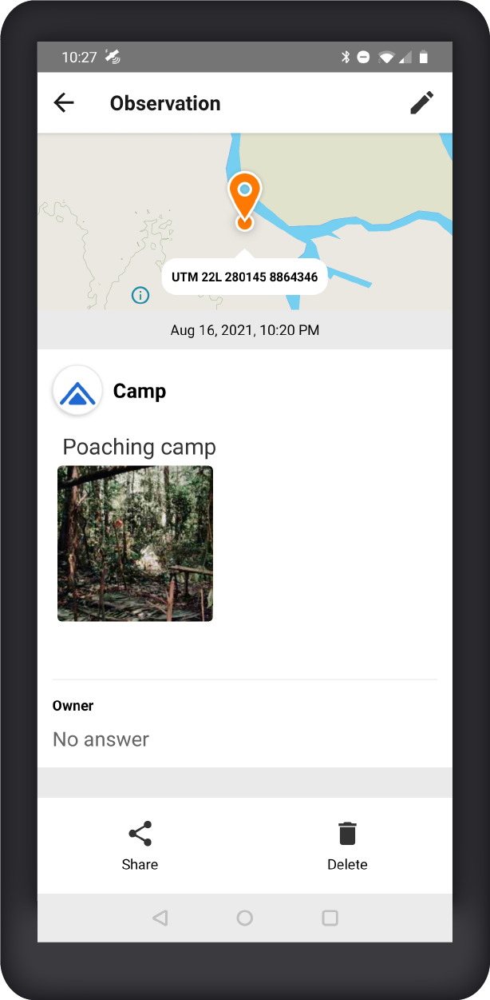

# Mapeo Mobile

## Installation

To install Mapeo Mobile on your Android device, ​[Download the latest version on Google Play.](https://play.google.com/store/apps/details?id=com.mapeo&hl=en_US)​ ​[You can also download the app as an APK](https://digital-democracy.org/mapeo/latest/android) and install manually on your phone. ​

## Collecting data

Users can collect data with Mapeo Mobile in the form of "observations." An observation is based on a geographic location \(a point on the map\) and can have associated photos, notes and details.   

Create a new observation by tapping the round orange \(+\) button on the bottom of the screen, then choose a category.

Add a description, photos and details. Tap the orange checkmark on the top right of the screen to save your observation.

## Viewing and editing data

Each observation will be marked on the map with an orange dot. Observations can also be viewed in a list by tapping the cards icon on the top right of the map screen.

Tap on an observation from the map or list to view. Tap the pencil icon on the top right to edit.

## Sharing data externally

Tap on the **Share** icon at the bottom of the screen to send the details of a single observation to a contact outside of Mapeo using one of the communications apps installed on your phone \(SMS, WhatsApp, Signal, etc.\).

## Deleting data

Tap the **Delete** icon to delete an observation and its associated media. Note: this action cannot be undone.

## Syncing data

Mapeo Mobile allows you to synchronize the data you have collected with other Mapeo users that members of the same project. To synchronize data between 2 devices,

* Connect both devices to the same WiFi network
* Enter Sync mode on both devices by tapping the lightning icon in the top left of the home screen
* Select the desired device in the list and tap the "Sync" button beside its name
* Keep the Sync screen open on both devices until the synchronization has completed.

