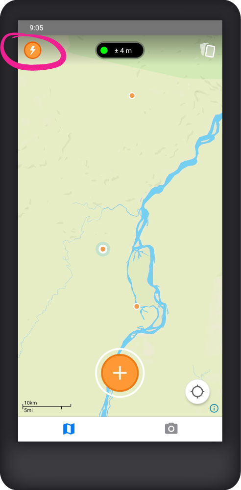
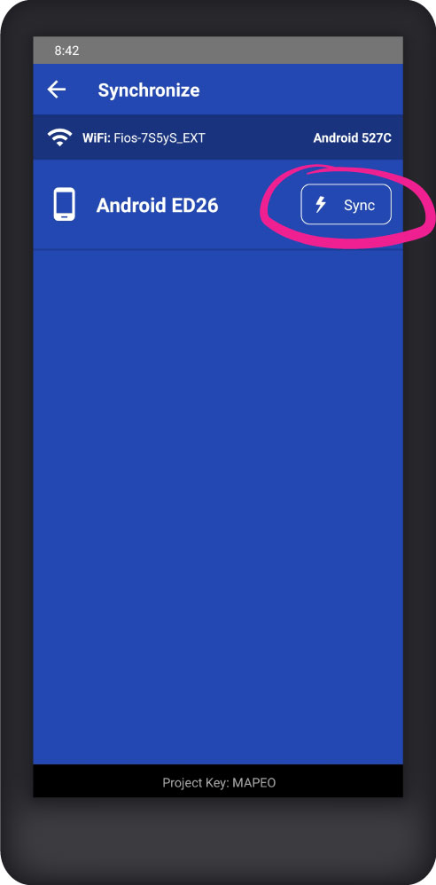

# Mapeo Mobile

## Instalar

Para instalar Mapeo Mobile en su dispositivo Android, [descargue la última versión en Google Play](https://play.google.com/store/apps/details?id=com.mapeo\&hl=en\_US). También puede [descargar la aplicación como APK](https://apk.mapeo.app/latest/) e instalarla manualmente en su teléfono. Para obtener más información sobre la instalación, consulte [installing-mapeo-mobile.md](../guia-de-referencia-completa/mapeo-mobile-installation-setup/installing-mapeo-mobile.md "mention").

## Recolectar datos

Recolecta datos con Mapeo Mobile en forma de _observaciones_. Una observación se basa en una ubicación geográfica (un punto en el mapa) y puede tener fotos, notas y detalles asociados. Para crear una nueva observación, haz clic en el botón **Crear observación** y luego seleccione una categoría.

 

Añade una descripción, fotos y detalles, y luego haz clic en el botón  **Guardar**.

## Ver observaciones

Cada observación se marcará en el mapa con un punto. Las observaciones también se pueden ver en forma de lista tocando el botón  **Listado de observaciones**.

 

Haz clic en una observación del mapa o de la lista para ver sus detalles.

## Editar una observación

Con los detalles de una observación abiertos, toque el botón  **Editar** para hacer cambios.

## Compartir datos externamente

Haz clic en el botón  **Compartir observación** para enviar los detalles de una sola observación a un contacto fuera de Mapeo utilizando una de las aplicaciones de comunicación instaladas en su teléfono (WhatsApp, Signal, Email, etc.).

## Borrar una observación

Haz clic en el botón  **Borrar** para eliminar una observación y sus medios asociados.


La eliminación de observaciones no se puede deshacer, así que tenga cuidado al usar eliminar.


## Sincronizar datos

Mapeo Mobile le permite sincronizar datos con otros usuarios de Mapeo que son participantes del mismo proyecto. Durante la sincronización, TODOS los datos de un dispositivo se enviarán al otro dispositivo y viceversa. Para obtener más información sobre la sincronización, consulte:

[peer-to-peer-and-mapeo-sync.md](../vision-general/about-mapeo/peer-to-peer-and-mapeo-sync.md "mention").

Para sincronizar datos entre 2 dispositivos Mapeo Mobile que están cerca uno del otro:&#x20;

1. Conecte ambos dispositivos a la misma red Wi-Fi. (No es necesario tener una conexión a Internet.)&#x20;
2. Toque el botón **Sincronizar** en ambos dispositivos.&#x20;
3. En la pantalla **Sincronizar**, identifique el dispositivo con el que desea sincronizar en la lista y toque el botón Sincronizar junto a su nombre. Mantenga abierta la pantalla Sincronizar en ambos dispositivos hasta que se complete la sincronización.


Para obtener instrucciones detalladas sobre cómo usar todas las funciones de Mapeo Mobile, consulte las siguientes secciones en la Guía de referencia completa:

[mapeo-mobile-installation-setup](../guia-de-referencia-completa/mapeo-mobile-installation-setup/ "mention")

[mapeo-mobile-use](../guia-de-referencia-completa/mapeo-mobile-use/ "mention")

