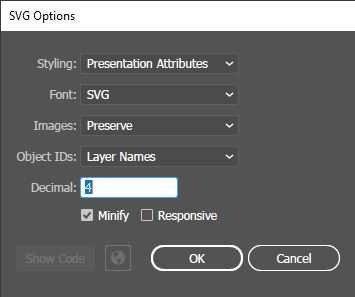

# Crear y exportar archivos SVG usando Adobe Illustrator

[Adobe Illustrator](https://www.adobe.com/products/illustrator.html) es un editor de gráficos vectoriales y un programa de diseño desarrollado por Adobe Inc. Aunque es un producto comercial con licencia, se usa muy comúnmente para crear gráficos vectoriales, y muchos usuarios también utilizan esta herramienta para crear íconos para Mapeo.

### Exportar archivos `.svg` con las propiedades adecuadas

Cuando esté listo para exportar un archivo gráfico vectorial a un formato de archivo `.svg` compatible con Mapeo, el proceso es el siguiente:&#x20;

* En el menú superior de Adobe Illustrator, haga clic en **Archivo** y luego seleccione **Exportar**, seguido de **Exportar como**.&#x20;
* Asegúrese de que **Use Artboards** esté marcado.

* Guarde su archivo `.svg` en el directorio correcto (**`icons`** para las configuraciones de Mapeo) y con el nombre de archivo deseado, y haga clic en **Exportar**.&#x20;
* En la siguiente ventana, asegúrese de que las siguientes propiedades estén configuradas y luego haga clic en **Aceptar**:

Su archivo `.svg` ahora debería estar listo para ser utilizado por Mapeo. Consulte [#naming-icon-files](./#naming-icon-files "mention") para obtener más información sobre cómo nombrar los archivos y dónde colocarlos en el directorio de configuración.
