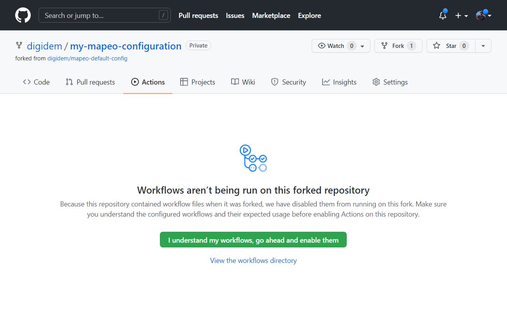
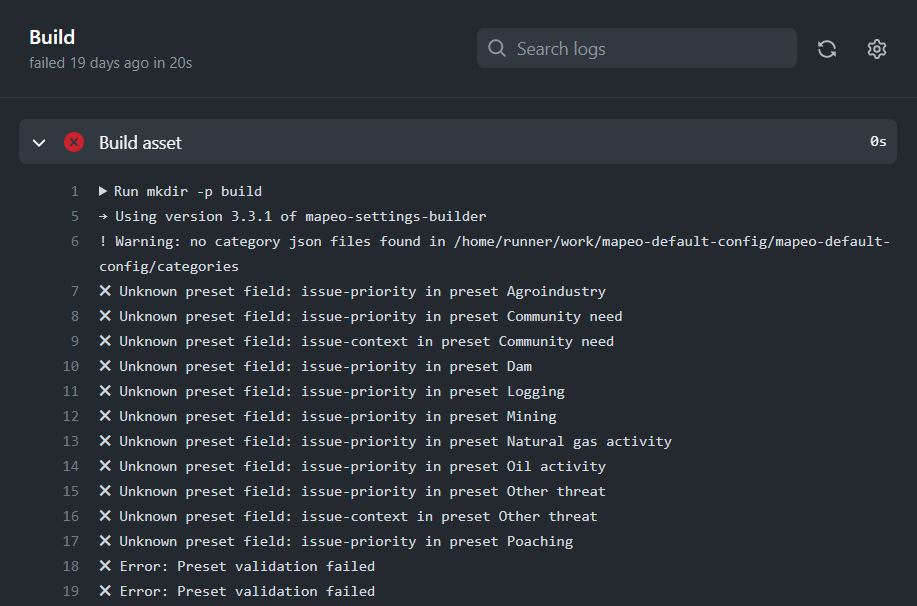
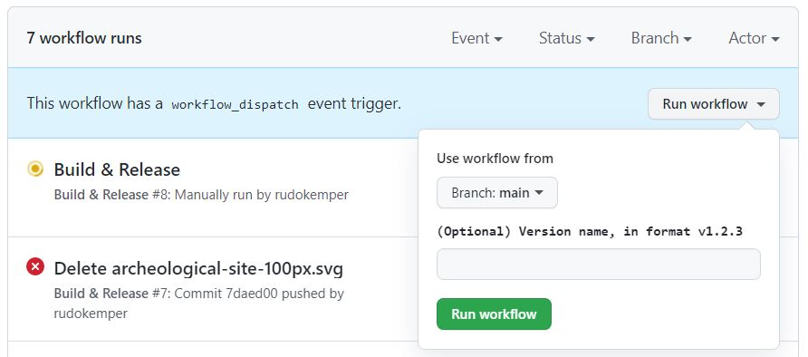
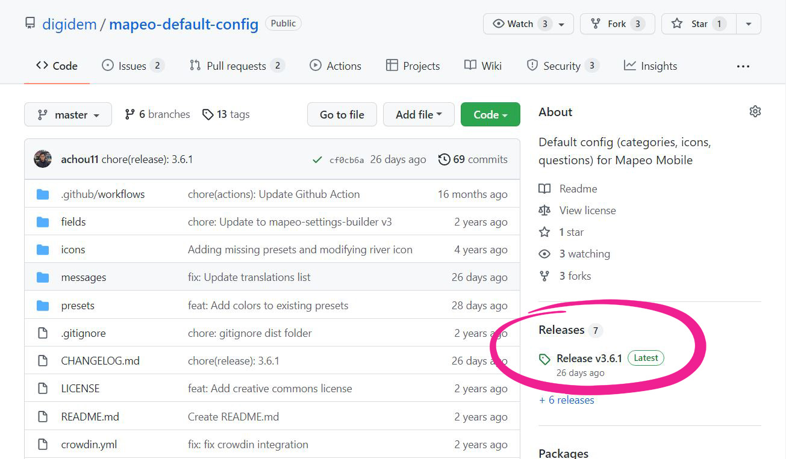

# Using GitHub Actions

It is possible to build a Mapeo configuration file using GitHub Actions. This requires setting up your custom configuration directory as a repository on [Github.com](https://github.com/), adding a `/.github/workflows/build.yml` script to your repository, and committing changes to that repository. &#x20;


If you haven't already used GitHub, you may want to study the [basics](https://docs.github.com/en/get-started/using-git/about-git) of how GitHub works before proceeding.



Note that since this process relies on using github.com, that you will need internet access to run the build action and download the `.mapeosettings` configuration file. Hence, unlike building a configuration [preparing-computer.md](preparing-computer.md "mention"), this process will not work in an offline context.


## Setting up a configuration repository on GitHub

The first step will be to set up your configuration as a repository on github.com, with the requisite build script files that will trigger a GitHub Actions **Workflow** to generate your `.mapeosettings` file. There are a few ways to do this.

_If you do not have your own custom configuration already, and are starting from scratch:_

1. You can fork or upload either the [Mapeo Default Configuration](https://github.com/digidem/mapeo-default-config) or the [Empty Mapeo Configuration](https://github.com/digidem/empty-mapeo-config) template to your own GitHub account. The choice you make will depend on how you will go about creating your own configuration, as detailed in [planeando-la-configuracion-y-la-estructura-de-datos](../../planeando-la-configuracion-y-la-estructura-de-datos/ "mention").
2. Make sure that you have the `.github/workflows` directory in your configuration repository.

_If you already have your own custom configuration:_

1. Create a repository on GitHub for your custom configuration.
2. Commit your existing configuration content to the repository.
3. Download either the [Mapeo Default Configuration](https://github.com/digidem/mapeo-default-config) or the [Empty Mapeo Configuration](https://github.com/digidem/empty-mapeo-config), and copy over the `.github` directory to the root directory of your custom configuration.&#x20;
4. Commit these files to your repository on Github.com. (_Github may ask you for additional permissions to add these files, by confirming via the browser.)_


**NOTE:** Depending on your operating system and setup, it is possible that you do not see a `.github/` directory anywhere. You may need to enable viewing hidden files in your system file manager.\
\
On MacOS, you can do so by pressing **Command + Shift + .** (period) in your Finder window.


## Getting ready to build

Navigate to the **Actions** screen, and Click "I understand my workflows, go ahead and enable them."

This will bring you to a view of your **Workflows**. You should see a message "There are no workflow runs yet" if you just enabled **Workflows** for the first time. You are now ready to start building `.mapeoconfig` files.

## How it works

Once you have enabled Action **Workflows** on your configuration repository, GitHub will generate a **Workflow** to build a new version of your configuration every single time that you commit a change to your repository. &#x20;

Once you have committed a change to your repository, and navigate to the **Actions** tab, you should see your commit message listed as a workflow.

.JPG>)

* :white\_check\_mark: a circular check indicates that the build has completed successfully.
* :yellow\_circle: a yellow circle indicates that the build is in process.
* :red\_circle: a red circle with an X indicates that the build has encountered an error.

You can click on your commit message to find out more about the status of your build. For example, if your build has encountered an error, there will be a log that can give you an idea of what went wrong. You can commit a change to fix the error, and return to the **Actions** screen to see if a new **Workflow** successfully bypasses the problem.


This is the same log that you would see when building a configuration [preparing-computer.md](preparing-computer.md "mention").


By opening the **Workflow** with your commit message, you can also download a `.zip` file of your configuration, which includes a temporary `.mapeosettings` file. This is helpful for testing out your configuration before building a versioned file to distribute to users, as described in [probando-e-iterando.md](../../probando-e-iterando.md "mention").

## Use conventional commit messages to increment your configuration version

The Mapeo GitHub Actions **Workflow** is set up to dynamically bump the version of your configuration per each workflow. It does so using [conventional commit messaging](https://www.conventionalcommits.org/en/v1.0.0-beta.2/) of adding `feat:`, `fix:`, or `chore:` before your commit message. For example, if you have a configuration with version **1.1.0**, the specific version bumps are as follows:

* `feat`: this will increase your version to **1.2.0**. This commit prefix could be used for major configuration updates.
* `fix`: this will increase your version to **1.1.1**. This commit prefix could be used for small updates like changing an icon, or adding a field to a category.
* `chore`: this will not increase your version. This commit prefix could be used for correcting typos or fixing errors.


To see a few examples of configuration conventional commit messaging, see the screenshot above in [#how-it-works](using-github-actions.md#how-it-works "mention"), or check out the commit history on the [Mapeo Default Configuration](https://github.com/digidem/mapeo-default-config/commits/master) repository.


You can also manually update the first number in your **1.1.0** version in your `package.json` file, but Digital Democracy's convention is to only do so to indicate breaking changes. That said, you are free to choose a versioning convention that makes the most sense to you.

## Compile a final, versioned release of your configuration

Once you are done making changes, have tested your configuration using a temporary `.mapeosettings` file (as described in [#how-it-works](using-github-actions.md#how-it-works "mention")) and in accordance to the process described in [probando-e-iterando.md](../../probando-e-iterando.md "mention"), you can generate a versioned release of your configuration. The way to do so is as follows:

* Navigate to the **Actions** tab for your GitHub repository. You should see all of your **Workflows** again.
* On the left sidebar, click on the **Build & Release** link.
* You should now see a box with the text "This workflow has a `workflow_dispatch` event trigger" and a button **Run workflow**. Click the button, and then click **Run workflow** again in the popup that will appear.

* Doing so will trigger another **Workflow** titled "Build and Release."
* When that finished with a :white\_check\_mark: green check mark, your versioned build release will be ready. On the top navigation bar, click on **Code** and your release should appear under the **Releases** panel in the right sidebar.

* Click on the release to download the versioned `.mapeosettings` file.&#x20;
