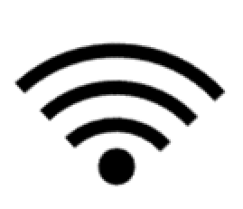

# Sincronizar a través de Wi-Fi

## Sincronizar a través de Wi-Fi

Mapeo Desktop puede sincronizar datos a través de Wi-Fi con otras  computadoras o celulares que usan Mapeo. Esta es una buena opción de sincronización cuando los dispositivos están cerca y **no tienen conexión a Internet**.&#x20;

Requisitos:&#x20;

* **Ambos dispositivos deben estar conectados a la misma red** **Wi-Fi** \
  Para que los dispositivos se sincronicen, ambos deben estar conectados a la misma red Wi-Fi. Esta red wifi no necesita tener conexión a internet.
* **Ambos dispositivos deben estar usando la misma configuración**\
  ****Solo es posible sincronizar con dispositivos que utilicen la misma [configuración](../../../customization-options/custom-configurations/#about-custom-configurations). Para obtener más información sobre cómo importar configuraciones, consulte [importing-configurations.md](../../../mapeo-mobile-installation-setup/importing-configurations.md "mention") o [importing-configurations.md](../../../mapeo-desktop-installation-setup/importing-configurations.md "mention").&#x20;

Para sincronizar, siga los pasos a continuación:

## Conectarse al Wi-Fi

Conecte ambos dispositivos de Mapeo a la misma red Wi-Fi. En entornos sin internet, se puede crear una red Wi-Fi local utilizando un enrutador inalámbrico móvil o un tercer dispositivo capaz de funcionar como un punto de acceso fuera de línea (hotspot).&#x20;


Para obtener más información sobre cómo crear una red Wi-Fi local o conectarse al Wi-Fi, consulte:\
[creating-local-wi-fi-networks](../../../troubleshooting/solving-sync-issues/creating-local-wi-fi-networks/ "mention")\
[connecting-to-wi-fi.md](../../../troubleshooting/solving-sync-issues/connecting-to-wi-fi.md "mention")


## Entrar al modo de Sincronización&#x20;

Para sincronizar, ambos dispositivos deben tener abierta la pantalla **Sincronizar**.

En Mapeo Desktop: Haga click en **Sincronizar** en el panel de **Modos de Mapeo**.

En Mapeo Mobile: Haga click en  **Sincronizar** en la pantalla principal.

&#x20;

Los dispositivos disponibles para la sincronización aparecerán en la pantalla **Sincronizar**.\


Recuerda que para que un dispositivo aparezca en la lista debe estar conectado a la misma red Wi-Fi, tener abierta la pantalla **Sincronizar** y estar usando la misma configuración de proyecto.

En Mapeo Desktop, puede confirmar qué configuración está usando Mapeo Desktop consultando la barra blanca en la parte inferior de la pantalla **Sincronizar**. En Mapeo Mobile, puede consultar la configuración usada en la pantalla de **Configuración de proyecto**, dentro de **Ajustes**.

Para solucionar problemas en este paso, consulte [solving-sync-issues](../../../troubleshooting/solving-sync-issues/ "mention").


## Comenzar sincronización

Una vez que los dispositivos disponibles aparecen en la lista, confirme la identidad del dispositivo con el que planea sincronizar consultando el número de identificación único en el dispositivo del otro usuario.&#x20;


Para ver el número de identificación único de un dispositivo Mapeo Mobile, consulte el lado derecho de la barra azul marino en la pantalla **Sincronizar** en Mapeo Mobile.


En Mapeo Desktop, haga click en el botón **SYNCRONIZAR**  **** debajo del nombre del dispositivo con el que quieres intercambiar datos.


**Importante**: Mantenga abierta la pantalla **Sincronizar** en ambos dispositivos hasta que se complete el proceso de sincronización.


## Ver observaciones sincronizadas&#x20;

Para obtener información sobre cómo ver y administrar datos sincronizados:

* En Mapeo Desktop, continua en [viewing-observations.md](../viewing-observations.md "mention")
* En Mapeo Mobile, vea[#view-synced-observations](../../../mapeo-mobile-use/wifi-sync.md#view-synced-observations "mention")<mark style="color:blue;"></mark>
