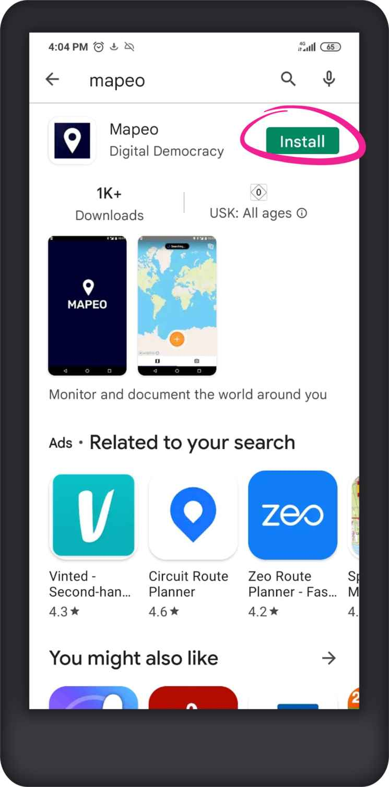

# Instalar Mapeo Mobile

Hay 2 formas de instalar Mapeo Mobile en su celular:&#x20;

* ****[**Instalar desde Play Store** ](installing-mapeo-mobile.md#instalar-desde-play-store)\
  Si tiene**conexión a Internet**, puede descargar e instalar Mapeo Mobile de forma gratuita desde Google Play Store.&#x20;
* ****[**Instalar desde un archivo APK** ](installing-mapeo-mobile.md#instalar-desde-un-archivo-apk)\
  Para instalar Mapeo Mobile en celulares que **no tienen****conexión a Internet**, puede usar un archivo de instalación (`.apk`).

## Instalar desde Play Store

Antes de comenzar, asegúrese de que:&#x20;

* Tienes unabuena conexión a Internet.&#x20;
* Tienes suficiente espacio disponible en su celular para la aplicación Mapeo y los datos que recopilará; le recomendamos que tenga al menos 1 GB (gigabyte) disponible.

Para instalar Mapeo Mobile en su celular desde Google Play Store:&#x20;

1. Abra la aplicación **Play Store** en su celular.&#x20;
2. En la barra de búsqueda en la parte superior de la ventana de Play Store, escriba **Mapeo** y haga clic en el icono de **lupa** en la parte inferior derecha del teclado.&#x20;
3. Haga clic en **Mapeo** en la lista de aplicaciones.&#x20;
4. En la pantalla de Mapeo Mobile en la aplicación Play Store, haga clic en **Instalar**.&#x20;
5. Cuando se complete el proceso de instalación, haga clic en **Abrir.**&#x20;
6. Cuando se abra Mapeo Mobile, se le pedirá que permita el acceso de Mapeo a la cámara y al GPS de su teléfono para que la aplicación funcione correctamente. Después de eso, la pantalla de inicio de Mapeo Mobile se abrirá automáticamente.

 


El proceso de instalación puede llevar mucho tiempo (más de 15 minutos), dependiendo de la calidad de tu conexión a Internet.



Si no tiene suficiente espacio disponible en su celular, recibirá un mensaje de Play Store invitándolo a eliminar contenido o aplicaciones de su dispositivo para liberar espacio.


> ▶Vídeo disponible: [Cómo instalar Mapeo Móvil desde Play Store](https://www.youtube.com/watch?v=-2EYN4pimXk)

## Instalar desde un archivo APK

Puede instalar Mapeo Mobile en un celular que no tenga conexión a Internet utilizando un archivo de instalación previamente descargado (`.apk`).&#x20;

Si ya tiene el archivo de instalación en su dispositivo, continúe aquí: [#instalar-desde-un-archivo-apk](installing-mapeo-mobile.md#instalar-desde-un-archivo-apk "mention")

### Descargar el archivo de instalación

Mientras haya una conexión a Internet disponible, [descargue el archivo de instalación de Mapeo](https://www.digital-democracy.org/mapeo/latest/android) (`.apk`).


Una vez descargado, el archivo APK puede compartirse con otros dispositivos y usarse para instalar Mapeo sin conexión.&#x20;

* Si tieneconexión a Internet, use cualquier aplicación de mensajería (como Telegram o WhatsApp) para enviar archivos de instalación`(.apk)`entre celulares.
* Si no tiene conexión a Internet, puede copiar el archivo desde una computadora usando un cable USB o enviar el archivo de instalación usando Bluetooth. Lea más sobre cómo enviar un archivo usando estos métodos en[sharing-files-between-devices.md](../troubleshooting/sharing-files-between-devices.md "mention").


### Instalar desde un archivo APK

1. Localice el archivo de instalación de Mapeo (`.apk`) en el dispositivo.&#x20;
2. Haga clic en el archivo de instalación (`.apk`) para abrirlo.&#x20;
3. En la ventana emergente, haga clic en **INSTALAR**. El proceso de instalación puede tardar varios minutos.&#x20;
4. Una vez completada la instalación, haga clic en **ABRIR** en la ventana emergente.&#x20;
5. Cuando se abra Mapeo Mobile, se le pedirá que permita el acceso de Mapeo a la cámara y al GPS de su celular para que la aplicación funcione correctamente. Después de eso, la pantalla de inicio de Mapeo Mobile se abrirá automáticamente.

&#x20;.jpg>)  

> ▶ Vídeo disponible: [Cómo instalar Mapeo Mobile desde un archivo APK](https://www.youtube.com/watch?v=eMJW1Hx3xQg)
