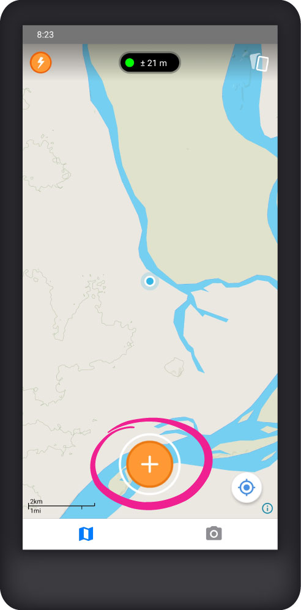

# Crear observaciones

Recolecta datos con Mapeo Mobile en forma de _observaciones_. Una observación se basa en una ubicación geográfica (un punto en el mapa) y puede tener fotos, notas y detalles asociados.

## Crear una nueva observación

Para crear una nueva observación, toque el botón **Crear observación**.

&#x20;


Las observaciones se pueden crear desde la pantalla de inicio del  **Mapa** o desde la pantalla de la  **Cámara**. Haga clic en  **Cámara** en la parte inferior de la pantalla de inicio para cambiar la vista.


## Seleccionar una categoría

Seleccione la categoría que mejor represente lo que está documentando en la observación. Mapeo viene con un conjunto predeterminado de categorías e íconos asociados que se pueden usar para recopilar y clasificar datos.

### 


Es posible crear categorías e íconos personalizados para adaptar Mapeo a las necesidades específicas de recopilación de datos. Esta personalización actualmente requiere un conocimiento técnico importante. Para obtener más información sobre la personalización, consulte [custom-configurations](../customization-options/custom-configurations/ "mention").


## Añadir una descripción

Haga click en el marcador de posición **¿Qué está pasando aquí?** para agregar una descripción de lo que está documentando.

&#x20;

## Añadir fotos

Haga click en  **Añadir Foto** para tomar una o más fotos y adjuntarlas a la observación.

&#x20;


Las fotos deben tomarse en el momento usando la cámara de su teléfono. Actualmente, Mapeo Mobile no le permite adjuntar imágenes existentes de una galería u otra fuente.


Para eliminar una foto de un borrador de observación, haga clic en la miniatura de la imagen. En la pantalla **Ver imagen**, haga clic en el botón**Eliminar Imagen**.


Si el botón **Eliminar Imagen** no está visible en la pantalla **Ver imagen**, haga clic en cualquier parte de la pantalla para mostrar.

\*La eliminación de imágenes de borradores de observaciones solo está disponible en Mapeo Mobile versión **5.4.0** o superior.


&#x20;

Para confirmar la eliminación, haz click en **Eliminar imagen** en la ventana de confirmación. Tenga en cuenta que una vez eliminadas, las imágenes no se pueden recuperar.

Si no desea continuar con la eliminación, haga clic en **Cancelar** y luego haga clic en el botón  **Cerrar** para volver a la pantalla **Nueva observación**.


Las imágenes no se pueden eliminar una vez que se ha guardado una observación.


## Añadir detalles

Dependiendo de la categoría que hayas seleccionado, es posible que veas la opción **Añadir detalles** en la parte inferior de la pantalla. Los detalles de la observación consisten en preguntas específicas para cada categoría de observación. Mapeo Mobile viene con preguntas básicas para algunas categorías. No es necesario agregar detalles al crear observaciones.

Haga clic en <mark style="color:blue;">**SIGUIENTE**</mark> para pasar a la siguiente pregunta y haga clic en <mark style="color:blue;">**LISTO**</mark> una vez que hayas respondido la última.

<mark style="color:red;"></mark>  <mark style="color:red;"></mark>  <mark style="color:red;"></mark>


Para configurar tus propias preguntas personalizadas o campos de detalles, debe personalizar Mapeo. Para más información, ver [custom-configurations](../customization-options/custom-configurations/ "mention")


## Guardar una observación

Una vez que haya agregado toda la información deseada, haz click en  **Guardar**.

### \* Nota sobre la precisión del GPS&#x20;

Si la señal GPS al momento de guardar la observación tiene una precisión menor a ± 10 m, Mapeo automáticamente te ofrecerá tres opciones:

1. Haga clic en **SEGUIR ESPERANDO** para esperar a que la señal GPS mejore.
2. Haga clic en **GUARDAR** para utilizar los datos GPS actuales, incluso si la precisión es inferior a ± 10 m.
3. Haga clic en **INGRESAR MANUALMENTE** para introducir manualmente las coordenadas que desea utilizar.\
   \
   \
   \
   Puede elegir qué formato de datos GPS desea usar para ingresar las coordenadas. Esta es una opción útil si tiene un dispositivo GPS u otro celular con una mejor precisión de la señal GPS.\
   \
    \
   \
   Haga clic en  **Guardar** una vez que haya ingresado manualmente las coordenadas para volver a la pantalla **Editar observación**.
