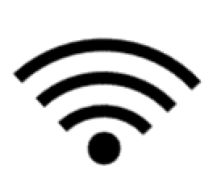

# Sincronizar datos a través Wi-Fi

## Acerca de la Sincronización de Mapeo

Mapeo Mobile le permite sincronizar los datos que ha recopilado con otros usuarios de Mapeo que son miembros del mismo proyecto. **La sincronización de datos no requiere una conexión a Internet y se puede realizar en áreas completamente fuera de línea.**

Para que los dispositivos se sincronicen, ambos deben estar en el mismo lugar y conectados a la misma  red Wi-Fi. **Esta red wifi no necesita tener conexión a internet.** En entornos fuera de línea, se puede crear una red WiFi local mediante un router inalámbrico portable o mediante la creación de un punto de acceso con un tercer teléfono inteligente.

.png>)


Para obtener más información sobre cómo crear una red Wi-Fi local, consulte[creating-local-wi-fi-networks](../troubleshooting/solving-sync-issues/creating-local-wi-fi-networks/ "mention")



Tenga en cuenta que al sincronizar con otro usuario de Mapeo, **TODOS LOS DATOS se comparten en ambas direcciones.** Recibirá todas las observaciones creadas por ese usuario y él recibirá todas sus observaciones. Sincronice solo con miembros de su proyecto en quienes confíe todos sus datos. Para obtener más información sobre este proceso, consulte [peer-to-peer-and-mapeo-sync.md](../../vision-general/about-mapeo/peer-to-peer-and-mapeo-sync.md "mention").

Todas las ediciones que se hayan realizado en los datos recopilados también se transferirán al otro dispositivo durante la sincronización. Por ejemplo, si una persona elimina o edita una observación y luego la sincroniza con otros dispositivos, esta observación se eliminará o editará en todos los dispositivos sincronizados.&#x20;

Es importante crear **protocolos de sincronización** de proyectos para garantizar que todos los datos pasen a formar parte de la base de datos del proyecto. Para más sobre eso, vea[creating-user-protocols.md](../essentials-for-a-successful-mapeo-project/creating-user-protocols.md "mention").


## Conectarse al WiFi

Conecte ambos dispositivos a la misma red Wi-Fi. La configuración de **Wi-Fi** generalmente se puede encontrar en el menú Configuración rápida, al que se puede acceder deslizando hacia abajo desde la parte superior de la pantalla.


Para más información sobre cómo conectarse a Wi-Fi, consulte [#connect-to-wi-fi-on-a-smartphone](../troubleshooting/solving-sync-issues/connecting-to-wi-fi.md#connect-to-wi-fi-on-a-smartphone "mention").


## Entrar en modo Sincronización

Haga click en el botón  **Sincronizar** en la pantalla de inicio de Mapeo de ambos dispositivos para ir a la pantalla **Sincronizar**.

\
La pantalla **Sincronizar** mostrará si está conectado a una red Wi-Fi. Si está conectado, podrá ver el nombre de la red a la que está conectado en la parte superior izquierda de la **barra azul marino**. También podrá ver el número de identificación único de su dispositivo en el lado derecho de la barra azul marino.

Los dispositivos disponibles para la sincronización se enumerarán a continuación.\
\
​​


Recuerde que para que un dispositivo aparezca en la lista, debe estar conectado a la misma red, tener abierta la pantalla **Sincronizar** y estar usando la misma configuración de proyecto. Para solucionar problemas en este paso, consulte[solving-sync-issues](../troubleshooting/solving-sync-issues/ "mention").


## Sincronizar datos&#x20;

Una vez que los dispositivos disponibles aparecen en la lista, confirme la identidad del dispositivo con el que planea sincronizar consultando el número de identificación único en el teléfono del otro usuario.

Haga clic en el botón **Sincronizar** junto al nombre del dispositivo para comenzar el intercambio de datos.


**IMPORTANTE:** Mantenga abierta la pantalla **Sincronizar** en AMBOS dispositivos hasta que se complete la sincronización. Interrumpir el proceso de sincronización puede resultar en datos dañados permanentemente.


## Ver observaciones sincronizadas

Puede ver los nuevos datos de observación recibidos en la sincronización mirando los puntos en la pantalla de inicio del  **Mapa** o en la pantalla de la  **lista de Observaciones**.

  

En la pantalla de la **lista de Observaciones**, las observaciones recopiladas por otros dispositivos aparecerán con una barra azul en el lado izquierdo.


En Mapeo Mobile, no puede editar ni eliminar las observaciones recolectadas por otros usuarios.

Recuerde que en Mapeo Desktop puede ver, editar y administrar todos los datos. Para más sobre eso, ver: [using-mapeo-desktop-to-manage-mapeo-mobile-data](../mapeo-desktop-use/using-mapeo-desktop-to-manage-mapeo-mobile-data/ "mention")

