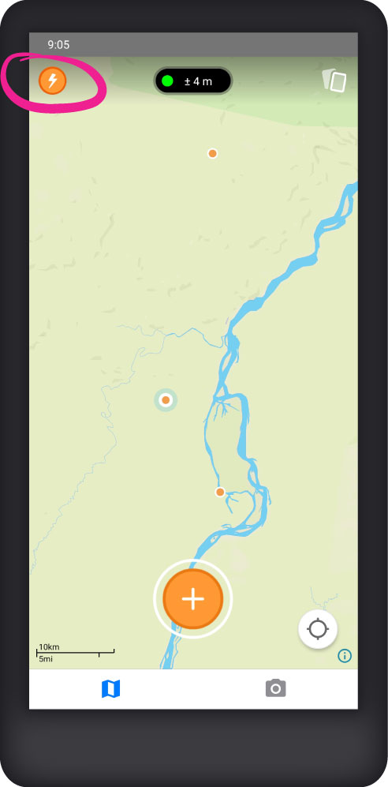
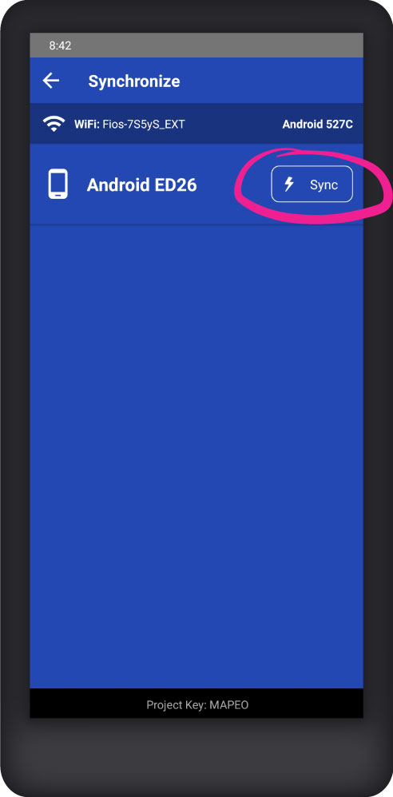

# Mapeo Mobile

## Install

To install Mapeo Mobile on your Android device,[ download the latest version on Google Play​](https://play.google.com/store/apps/details?id=com.mapeo\&hl=en\_US). ​You can also [download the app as an APK ](https://apk.mapeo.app/latest/)and install it manually on your phone. ​For more on installation, see [installing-mapeo-mobile.md](../complete-reference-guide/mapeo-mobile-installation-setup/installing-mapeo-mobile.md "mention").

## Collect data

You collect data with Mapeo Mobile in the form of _observations_. An observation is based on a geographic location (a point on the map) and can have associated photos, notes and details.&#x20;

To create a new observation, tap the  **Create observation** button, then select a category.

 

Add a description, photos and details, then tap the  **Save** button.

## View observations

Each observation will be marked on the map with a dot. Observations can also be viewed in list form by tapping the  **Observations list** button.

 

Tap on an observation from the map or list to view its details.

## Edit an observation

With the details of an observation open, tap the  **Edit** button to make changes.

## Share data externally

Tap on the  **Share observation** button to send the details of a single observation to a contact outside of Mapeo using one of the communications apps installed on your phone (WhatsApp, Signal, Email, etc.).

## Delete an observation

Tap the  **Delete** button to delete an observation and its associated media.


Deleting observations cannot be undone, so exercise caution when using delete.


## Synchronize data

Mapeo Mobile allows you to synchronize data with other Mapeo users that are participants of the same project. During synchronization, ALL data from one device will be sent to the other device and vice versa. For more on synchronization, see: [peer-to-peer-and-mapeo-sync.md](../overview/about-mapeo/peer-to-peer-and-mapeo-sync.md "mention").

To synchronize data between 2 Mapeo Mobile devices that are near each other:

1. Connect both devices to the same Wi-Fi network. (You do not need to have an internet connection.)
2. Tap the  **Synchronize** button on both devices.
3. On the **Synchronize** screen, identify the device you wish to synchronize with in the list and tap the **Sync** button beside its name.
4.  Keep the **Synchronize** screen open on both devices until the synchronization has completed.

    


For detailed instructions on how to use all features of Mapeo Mobile, see below sections in the Complete Reference Guide:

[mapeo-mobile-installation-setup](../complete-reference-guide/mapeo-mobile-installation-setup/ "mention")

[mapeo-mobile-use](../complete-reference-guide/mapeo-mobile-use/ "mention")

